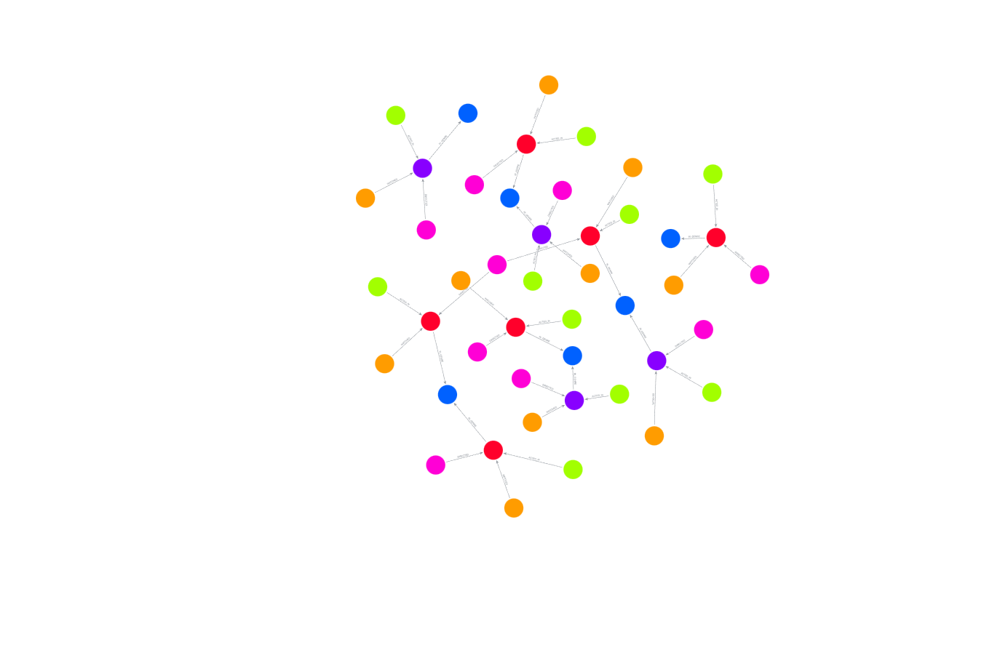
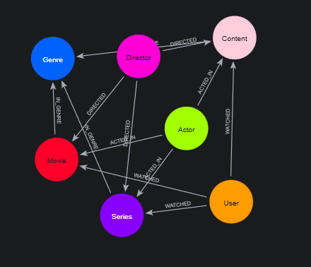

# 🎬 Sistema de Recomendação de Filmes com Neo4j
 Este projeto implementa um banco de dados em grafo para um sistema de recomendação de filmes e séries, utilizando Neo4j e a linguagem Cypher.
## 🧠 Modelo Conceitual
O modelo foca na conexão entre usuários e conteúdos, enriquecido com informações de elenco, direção e gênero para permitir recomendações precisas.

esboço da modelagem do grafo

          (User)
             │
      [:WATCHED {rating}]
             ▼
         (Content) ◄─── [:IN_GENRE] ─── (Genre)
          /     \
         /       \
   [:ACTED_IN] [:DIRECTED]
       /           \
    (Actor)      (Director)
🚀 Como Executar
Certifique-se de ter o Neo4j Desktop ou Neo4j AuraDB instalado.

Copie o conteúdo do arquivo filmes.cypher deste repositório.

Cole no terminal do Neo4j Browser e execute.
### 📊 Visualização do Projeto

Abaixo, a representação visual de como os usuários, filmes e atores se conectam no nosso banco de dados:

#### 🏗️ Esquema de Dados (Schema)
Este é o esqueleto do nosso banco:

